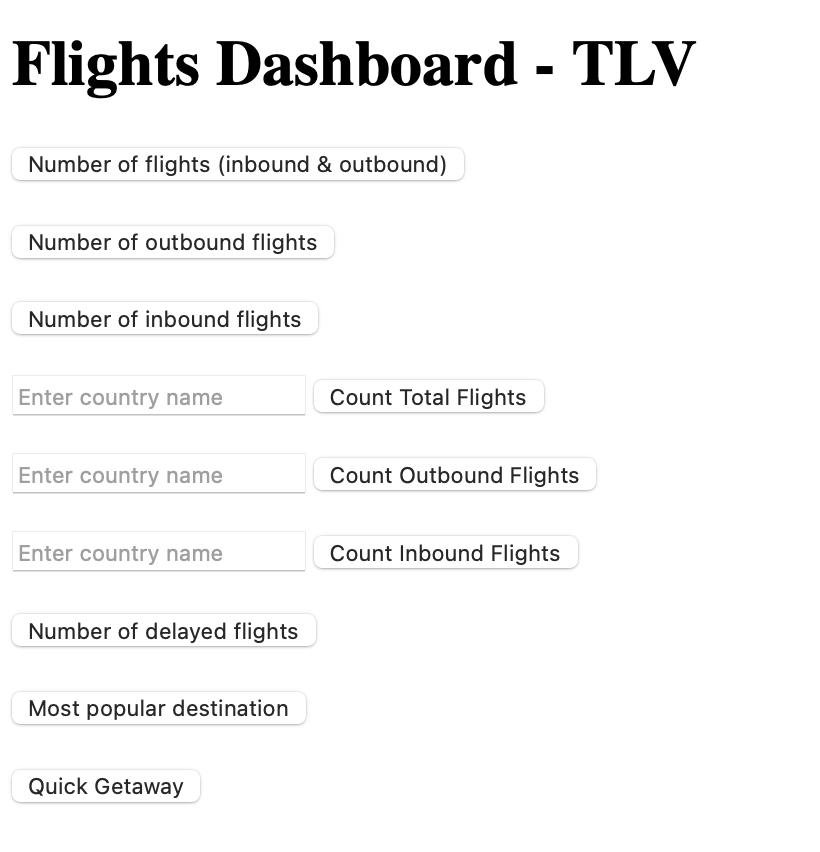

# TLV Flight Information Web Server

## Table of Contents

- [Overview](#overview)
- [Features](#features)
- [Sanitization](#sanitization)
- [Caching Strategy](#caching-strategy)
- [Libraries Used](#libraries-used)
- [Requirements](#requirements)
- [Running the Server Locally](#running-the-server-locally)
- [Dockerizing the Web Server](#dockerizing-the-web-server)
- [Unit Testing](#unit-testing)

## Overview
This project implements a web server that provides information about inbound and outbound flights from TLV airport using the [data.gov.il API](https://data.gov.il/dataset/flydata/resource/e83f763b-b7d7-479e-b172-ae981ddc6de5).

The server is built with Node.js, a runtime environment for executing JavaScript code server-side, and Express, a library that simplifies the development of web applications and APIs.

The project includes a simple graphical user interface (GUI) to facilitate testing and interacting with the API endpoints. The GUI is served from the public directory. 
You can access the GUI by navigating to http://localhost:3000 in your web browser after starting the server. This interface allows you to easily test and view responses from the various API endpoints without needing to use external tools or manually construct HTTP requests.

## Features

The web server supports the following APIs:

### 1. Count All Flights (Inbound & Outbound)
- **Endpoint**: `/api/flights/count`
- **Method**: `GET`
- **Description**: Returns the total number of flights (both inbound and outbound).
- **Response Example**: `192`

### 2. Count Outbound Flights
- **Endpoint**: `/api/flights/outbound/count`
- **Method**: `GET`
- **Description**: Returns the number of outbound flights.
- **Response Example**: `64`

### 3. Count Inbound Flights
- **Endpoint**: `/api/flights/inbound/count`
- **Method**: `GET`
- **Description**: Returns the number of inbound flights.
- **Response Example**: `128`

### 4. Count Flights from a Specific Country (Inbound & Outbound)
- **Endpoint**: `/api/flights/country/count`
- **Method**: `GET`
- **Query Parameter**: `country=<Country Name>`
- **Description**: Returns the number of flights (inbound and outbound) from the specified country.
- **Response Example**: `68`

### 5. Count Outbound Flights from a Specific Country
- **Endpoint**: `/api/flights/country/outbound/count`
- **Method**: `GET`
- **Query Parameter**: `country=<Country Name>`
- **Description**: Returns the number of outbound flights from the specified country.
- **Response Example**: `16`

### 6. Count Inbound Flights from a Specific Country
- **Endpoint**: `/api/flights/country/inbound/count`
- **Method**: `GET`
- **Query Parameter**: `country=<Country Name>`
- **Description**: Returns the number of inbound flights from the specified country.
- **Response Example**: `52`

### 7. Count Delayed Flights
- **Endpoint**: `/api/flights/delayed/count`
- **Method**: `GET`
- **Description**: Returns the number of delayed flights.
- **Response Example**: `200`

### 8. Most Popular Destination
- **Endpoint**: `/api/flights/destination/popular`
- **Method**: `GET`
- **Description**: Returns the city with the highest number of outbound flights.
- **Response Example**: `"AMSTERDAM"`

### 9. Quick Getaway Flights
- **Endpoint**: `/api/flights/getaway`
- **Method**: `GET`
- **Description**: Returns a pair of flights (one departing from Israel and one arriving in Israel) that someone can take for a quick getaway. If no such flights are found, returns an empty object.
- **Response Example**: `{ "departure": "LX2526", "arrival": "LX257" }` or `{}`

## Sanitization

Sanitization is implemented to ensure that user input is safe and does not pose security risks. In this project, sanitization is achieved using the validator module.

- **General Query Sanitization**: All query parameters are sanitized to remove any potentially harmful characters. This process prevents injection attacks and ensures that input data is clean and safe for further processing.
- **Country Query Parameter**: Specifically for the country query parameter, the application checks if the provided country name is valid by comparing it against a predefined set of acceptable country names. If the country name is invalid, the application returns a 400 error response. This validation helps protect against attacks that could exploit invalid or malicious input.

## Caching Strategy

To improve performance and reduce the load on the external API, a caching mechanism is used for storing flight data. The cache is refreshed every 5 minutes. Here’s why a 5-minute TTL (Time-To-Live) was chosen:

- **Data Freshness**: The external API updates every 15 minutes. A 5-minute TTL ensures that the cached data is sufficiently fresh, providing users with relatively up-to-date information while avoiding stale data.
- **Efficiency and Resource Usage**: A 5-minute TTL strikes a balance between data freshness and efficient use of server and network resources. It helps in reducing the frequency of API calls and processing overhead compared to a shorter TTL.
- **Handling Timing Issues**: A TTL of 5 minutes provides a buffer to handle potential timing issues and delays in data availability, ensuring that the cache is updated regularly but not excessively.
By using a 5-minute TTL, we ensure that users receive reasonably current flight information while minimizing the impact on server performance and external API usage

## Libraries Used

- **axios**: A promise-based HTTP client for making requests to the external API. It simplifies HTTP requests and provides a clean API for handling responses and errors.
- **express**: A web framework for Node.js that provides utilities for routing, handling HTTP requests, and middleware integration.
- **node-cache**: A simple in-memory caching module for Node.js. It is used to store flight data temporarily and control cache expiration.
- **validator**: A library for string validation and sanitization. It is used to validate and sanitize input data, ensuring that the requests are valid and free from potential security issues.

## Requirements

- **Language**: Node.js
- **Port**: 8080, 3000

## Running the Server Locally

1. Clone the repository
2. Install dependencies:
    - npm install
3. Start the server:
    - npm start
4. Access the server at http://localhost:3000.

## Dockerizing the Web Server

1. Build the Docker image:
    - docker build -t tlv-flight-web-server .
2. Run the Docker container 
    - docker run -d -p 8080:3000 tlv-flight-web-server
3. Access the server at http://localhost:8080.

## Unit Testing

This project uses unit tests to ensure the correctness and reliability of its functionality. The tests are written using Jest, a JavaScript testing framework, and Supertest, a library for testing HTTP servers.

### Test Structure

The tests are organized into the following directories:

- **`test/setup`**: Contains setup and teardown logic for the test environment, including mocks and server setup.
- **`test/endpoints`**: Contains tests for various API endpoints, verifying that they return the expected responses and handle different scenarios correctly.
- **`test/general`**: Includes general utility tests and any other tests that do not fit into the endpoint-specific or validation categories.
- **`test/validation`**: Focuses on validating input data and handling edge cases, ensuring that the application correctly processes, validates user input and preventing attacks.

### Running the Tests

To run the unit tests, use the following command:
- npm test -- --runInBand

   
